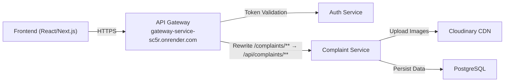
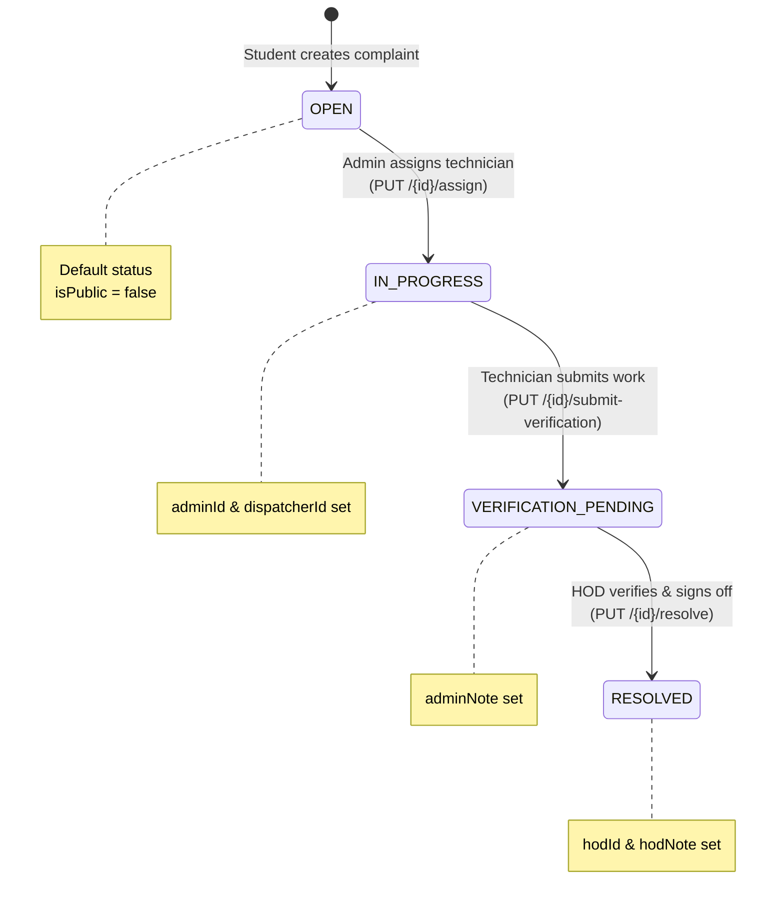

# 🛠️ Complaint Service — Complete Frontend Developer Guide

> **Base URL (Gateway):** `https://gateway-service-sc5r.onrender.com`
>
> All complaint endpoints go through the gateway at path prefix `/complaints/...`. The gateway rewrites `/complaints/**` → `/api/complaints/**` internally. You **never** hit `/api/complaints/...` directly from the frontend.

---

## Table of Contents

1. [Architecture Overview](#1-architecture-overview)
2. [Authentication System](#2-authentication-system)
3. [Role & Permission Matrix](#3-role--permission-matrix)
4. [Complete API Endpoint Reference](#4-complete-api-endpoint-reference)
5. [Data Models & Response Shapes](#5-data-models--response-shapes)
6. [Complaint Lifecycle State Machine](#6-complaint-lifecycle-state-machine)
7. [Pages & Components Per Role](#7-pages--components-per-role)
8. [Detailed Input Fields Reference](#8-detailed-input-fields-reference)
9. [Error Handling](#9-error-handling)
10. [Important Notes & Gotchas](#10-important-notes--gotchas)

---

## 1. Architecture Overview



**Request Flow:**
1. Frontend sends request to `https://gateway-service-sc5r.onrender.com/complaints/...`
2. Gateway checks if the route is secured (all complaint routes except `/complaints/public` are secured)
3. For secured routes, gateway extracts the `Authorization: Bearer <token>` header and calls Auth Service's `/api/auth/validate` endpoint
4. If valid, gateway forwards the request (with the original `Authorization` header intact) to the Complaint Service
5. Complaint Service's own `JwtTokenFilter` parses the JWT to extract `username` (subject), `role`, and `subRole` claims to enforce `@PreAuthorize` rules
6. Response flows back through the gateway to the frontend

---

## 2. Authentication System

### 2.1 Login Endpoint

```
POST https://gateway-service-sc5r.onrender.com/api/auth/login
Content-Type: application/json
```

**Request Body:**
```json
{
  "username": "string (enrollment number or staff ID)",
  "password": "string",
  "role": "string (optional — if provided, server validates it matches the user's actual role)"
}
```

**Success Response (200):**
```json
{
  "token": "eyJhbGciOiJIUzI1NiJ9...",
  "type": "Bearer",
  "id": 1,
  "username": "0901CS211082",
  "role": "STUDENT",
  "subRole": "NONE",
  "fullName": "Shivam Sharma",
  "email": "shivam@example.com"
}
```

**Error Response (400):**
```json
{
  "message": "Invalid username or password."
}
```

### 2.2 How to Store & Use the Token

After login, store the response in localStorage or a secure cookie:
```javascript
// After successful login
localStorage.setItem('token', response.token);
localStorage.setItem('user', JSON.stringify({
  id: response.id,
  username: response.username,
  role: response.role,
  subRole: response.subRole,
  fullName: response.fullName,
  email: response.email
}));
```

**Every subsequent API call** must include the token:
```javascript
const headers = {
  'Authorization': `Bearer ${localStorage.getItem('token')}`
};
```

### 2.3 JWT Token Structure (Decoded Payload)

```json
{
  "sub": "0901CS211082",          // username (enrollment number)
  "role": "STUDENT",              // primary role
  "sub_role": "NONE",            // sub-role (NOTE: key is "sub_role" in JWT)
  "fullName": "Shivam Sharma",
  "email": "shivam@example.com",
  "iat": 1752652800,
  "exp": 1752739200
}
```

> [!IMPORTANT]
> The JWT has the claim key `sub_role` (with underscore), but the complaint service's JwtTokenFilter reads it as `subRole` (camelCase). This is a **known mismatch** in the codebase. The complaint service reads `claims.get("subRole", ...)` but auth service writes `claims.put("sub_role", ...)`. This means **SUB_HOD authority will NOT be granted** unless this is fixed. Flag this to the backend team or ensure the claim key is consistent.

### 2.4 How Authorities Are Constructed in the Complaint Service

From the JWT, the complaint service creates Spring Security authorities as:
- **Primary Role:** `"ROLE_" + role` → e.g., `ROLE_STUDENT`, `ROLE_ADMIN`, `ROLE_FACULTY`
- **Sub-Role:** `"SUB_" + subRole` → e.g., `SUB_HOD`, `SUB_TECHNICIAN` (only if subRole ≠ "NONE")

---

## 3. Role & Permission Matrix

### 3.1 Roles in the System

| Role | Description | Sub-Roles That Matter |
|------|-------------|----------------------|
| `STUDENT` | Students who file complaints | `NONE`, `CR` |
| `FACULTY` | Faculty members who can file complaints | `PROFESSOR`, `HEAD_OF_DEPT` |
| `HOD` | Head of Department | `HEAD_OF_DEPT` |
| `STAFF` | Non-teaching staff | `TECHNICIAN`, `LAB_INCHARGE`, `OFFICE_ADMIN` |
| `ADMIN` | System administrators | `SYSTEM_ADMIN`, `SUPER_ADMIN` |

### 3.2 Endpoint Access by Role

| Endpoint | Method | Required Authority | Who Can Access |
|----------|--------|--------------------|----------------|
| `POST /complaints/` | POST | `ROLE_STUDENT` | Students only |
| `PUT /complaints/{id}/assign` | PUT | `ROLE_ADMIN` | Admins only |
| `PUT /complaints/{id}/submit-verification` | PUT | `ROLE_TECHNICIAN` or `ROLE_ADMIN` | Technicians or Admins |
| `PUT /complaints/{id}/resolve` | PUT | `SUB_HOD` | Users with sub-role `HOD` |
| `PUT /complaints/{id}/visibility` | PUT | `ROLE_ADMIN` | Admins only |
| `GET /complaints/assigned` | GET | `ROLE_TECHNICIAN` or `TECHNICIAN` | Technicians |
| `GET /complaints/pending-approval` | GET | `SUB_HOD` | Users with sub-role `HOD` |
| `GET /complaints/{id}` | GET | `isAuthenticated()` | Any logged-in user (private complaints restricted to owner + admin) |
| `GET /complaints/public` | GET | `isAuthenticated()` | Any logged-in user (also open in gateway without token) |
| `GET /complaints/user/{userId}` | GET | `ROLE_STUDENT`, `ROLE_FACULTY`, `STUDENT`, `FACULTY`, or `ROLE_ADMIN` | Students, Faculty, Admins |
| `GET /complaints/all` | GET | `ROLE_ADMIN` | Admins only |

> [!WARNING]
> The `GET /complaints/public` endpoint is listed in the gateway's `RouteValidator.openApiEndpoints` as an open route (no token required at gateway level). However, the complaint service controller has `@PreAuthorize("isAuthenticated()")` on it. This means the **gateway will pass the request through without a token**, but the **complaint service will reject it with 401** unless a valid token is provided. You should always send the token if you have it, or inform the backend team to remove the `@PreAuthorize` on the public feed endpoint.

---

## 4. Complete API Endpoint Reference

### 4.1 `POST /complaints/` — Create a New Complaint

**Access:** `ROLE_STUDENT` only

**Content-Type:** `multipart/form-data`

> [!IMPORTANT]
> This is NOT a JSON endpoint. It uses `multipart/form-data` with two parts: a JSON string part named `data` and optional file parts named `files`.

**Request Structure (multipart/form-data):**

| Part Name | Type | Required | Description |
|-----------|------|----------|-------------|
| `data` | `String` (JSON) | ✅ Yes | JSON string containing complaint details |
| `files` | `File[]` | ❌ No | One or more image files (uploaded to Cloudinary) |

**The `data` JSON string must contain:**
```json
{
  "userId": "string — REQUIRED — The enrollment number/username of the student filing the complaint",
  "title": "string — REQUIRED — Title/subject of the complaint",
  "description": "string — REQUIRED — Detailed description of the issue",
  "category": "string — REQUIRED — Category of the complaint (e.g., 'Infrastructure', 'IT', 'Hostel', 'Academics', 'Library', 'Canteen', 'Transport', 'Other')",
  "priority": "string — REQUIRED — One of: 'LOW', 'MEDIUM', 'HIGH', 'CRITICAL' (case-insensitive, will be uppercased)",
  "location": "string — OPTIONAL — Physical location where the issue exists (e.g., 'Room 301, CS Block')"
}
```

**Example JavaScript (using FormData):**
```javascript
const complaintData = {
  userId: "0901CS211082",
  title: "Broken AC in CS Lab 3",
  description: "The air conditioner in CS Lab 3 has not been working for 2 weeks. Temperature goes above 40°C making it unbearable for students.",
  category: "Infrastructure",
  priority: "HIGH",
  location: "CS Lab 3, First Floor, CS Block"
};

const formData = new FormData();
formData.append('data', JSON.stringify(complaintData));

// Optional: attach image files
if (selectedFiles.length > 0) {
  selectedFiles.forEach(file => {
    formData.append('files', file);
  });
}

const response = await fetch('https://gateway-service-sc5r.onrender.com/complaints/', {
  method: 'POST',
  headers: {
    'Authorization': `Bearer ${token}`
    // Do NOT set Content-Type — browser sets it automatically with boundary for multipart
  },
  body: formData
});
```

**Success Response (201 Created):**
```json
{
  "id": 1,
  "userId": "0901CS211082",
  "dispatcherId": null,
  "adminId": null,
  "hodId": null,
  "title": "Broken AC in CS Lab 3",
  "description": "The air conditioner in CS Lab 3 has not been working for 2 weeks...",
  "category": "Infrastructure",
  "priority": "HIGH",
  "location": "CS Lab 3, First Floor, CS Block",
  "upvoteCount": 0,
  "public": false,
  "status": "OPEN",
  "adminNote": null,
  "hodNote": null,
  "createdAt": "2026-07-16T12:00:00",
  "updatedAt": "2026-07-16T12:00:00",
  "images": [
    {
      "id": 1,
      "imageUrl": "https://res.cloudinary.com/xxx/image/upload/v123/abc.jpg",
      "cloudId": "abc",
      "timestamp": "2026-07-16T12:00:00"
    }
  ]
}
```

---

### 4.2 `PUT /complaints/{id}/assign` — Assign Technician to Complaint

**Access:** `ROLE_ADMIN` only

**Content-Type:** `application/x-www-form-urlencoded` (uses `@RequestParam`)

**Parameters (query params or form-encoded):**

| Parameter | Type | Required | Description |
|-----------|------|----------|-------------|
| `adminId` | `String` | ✅ Yes | The username/enrollmentNumber of the **technician** being assigned. Despite the misleading name, this is the technician's ID. |
| `dispatcherId` | `String` | ✅ Yes | The username/enrollmentNumber of the **admin** who is dispatching/assigning this complaint |

> [!NOTE]
> The naming is confusing: `adminId` in the database actually stores the **technician's** ID (the person assigned to fix it), and `dispatcherId` stores the **admin's** ID (the person who assigned it). Keep this in mind when building the UI.

**Example Request:**
```
PUT https://gateway-service-sc5r.onrender.com/complaints/1/assign?adminId=TECH001&dispatcherId=ADMIN001
Authorization: Bearer <admin_token>
```

**Or using fetch:**
```javascript
const response = await fetch(
  `https://gateway-service-sc5r.onrender.com/complaints/${complaintId}/assign?adminId=${technicianId}&dispatcherId=${currentAdminUsername}`,
  {
    method: 'PUT',
    headers: {
      'Authorization': `Bearer ${token}`
    }
  }
);
```

**Success Response (200):**
Returns the updated Complaint object with:
- `adminId` set to the technician's ID
- `dispatcherId` set to the admin's ID
- `status` changed to `"IN_PROGRESS"`

---

### 4.3 `PUT /complaints/{id}/submit-verification` — Submit Work for HOD Verification

**Access:** `ROLE_TECHNICIAN` or `ROLE_ADMIN`

**Parameters (query params):**

| Parameter | Type | Required | Description |
|-----------|------|----------|-------------|
| `adminNote` | `String` | ✅ Yes | The technician's note describing what work was done to fix the issue |

**Example Request:**
```
PUT https://gateway-service-sc5r.onrender.com/complaints/1/submit-verification?adminNote=Replaced%20the%20AC%20compressor%20and%20refilled%20gas
Authorization: Bearer <technician_token>
```

**Example JavaScript:**
```javascript
const response = await fetch(
  `https://gateway-service-sc5r.onrender.com/complaints/${complaintId}/submit-verification?adminNote=${encodeURIComponent(note)}`,
  {
    method: 'PUT',
    headers: {
      'Authorization': `Bearer ${token}`
    }
  }
);
```

**Success Response (200):**
Returns updated Complaint with:
- `adminNote` set to the provided note
- `status` changed to `"VERIFICATION_PENDING"`

---

### 4.4 `PUT /complaints/{id}/resolve` — HOD Final Sign-off

**Access:** `SUB_HOD` only (users with sub-role `HOD`)

**Parameters (query params):**

| Parameter | Type | Required | Description |
|-----------|------|----------|-------------|
| `hodId` | `String` | ✅ Yes | The username/enrollmentNumber of the HOD signing off |
| `hodNote` | `String` | ✅ Yes | The HOD's verification note (e.g., "Verified — AC is working properly now") |

**Example Request:**
```
PUT https://gateway-service-sc5r.onrender.com/complaints/1/resolve?hodId=HOD_CS01&hodNote=Verified%20and%20working
Authorization: Bearer <hod_token>
```

**Example JavaScript:**
```javascript
const response = await fetch(
  `https://gateway-service-sc5r.onrender.com/complaints/${complaintId}/resolve?hodId=${currentUser.username}&hodNote=${encodeURIComponent(note)}`,
  {
    method: 'PUT',
    headers: {
      'Authorization': `Bearer ${token}`
    }
  }
);
```

**Success Response (200):**
Returns updated Complaint with:
- `hodId` set
- `hodNote` set
- `status` changed to `"RESOLVED"`

---

### 4.5 `PUT /complaints/{id}/visibility` — Toggle Public Visibility

**Access:** `ROLE_ADMIN` only

**Parameters (query params):**

| Parameter | Type | Required | Description |
|-----------|------|----------|-------------|
| `isPublic` | `boolean` | ✅ Yes | `true` to make the complaint visible in the public feed, `false` to make it private |

**Example Request:**
```
PUT https://gateway-service-sc5r.onrender.com/complaints/1/visibility?isPublic=true
Authorization: Bearer <admin_token>
```

**Success Response (200):**
Returns updated Complaint with `public` field changed.

> [!NOTE]
> In the JSON response, the field is serialized as `"public"` (not `"isPublic"`) because of Java/Jackson boolean naming conventions. When reading the response, access it as `complaint.public`.

---

### 4.6 `GET /complaints/assigned` — Get Technician's Assigned Complaints

**Access:** `ROLE_TECHNICIAN` or `TECHNICIAN`

**Parameters:** None (the technician's ID is extracted from the JWT token automatically — `authentication.getName()`)

**Example Request:**
```
GET https://gateway-service-sc5r.onrender.com/complaints/assigned
Authorization: Bearer <technician_token>
```

**Success Response (200):**
```json
[
  {
    "id": 1,
    "userId": "0901CS211082",
    "adminId": "TECH001",
    "status": "IN_PROGRESS",
    ...
  },
  ...
]
```

---

### 4.7 `GET /complaints/pending-approval` — Get Complaints Awaiting HOD Approval

**Access:** `SUB_HOD` only

**Parameters:** None

**Example Request:**
```
GET https://gateway-service-sc5r.onrender.com/complaints/pending-approval
Authorization: Bearer <hod_token>
```

**Success Response (200):**
Returns array of all complaints with `status = "VERIFICATION_PENDING"`.

---

### 4.8 `GET /complaints/{id}` — Get Single Complaint by ID

**Access:** Any authenticated user

**Parameters:**

| Parameter | Type | Required | Description |
|-----------|------|----------|-------------|
| `id` | `Long` (path) | ✅ Yes | The complaint ID |

**Access Rules:**
- If the complaint is **public** (`isPublic = true`): any authenticated user can view it
- If the complaint is **private** (`isPublic = false`): only the **complaint owner** (matching `userId`) or users with **ROLE_ADMIN** authority can view it
- Others get `403 Forbidden` with message: `"Access Denied: You do not have permission to view this private ticket."`

**Example Request:**
```
GET https://gateway-service-sc5r.onrender.com/complaints/1
Authorization: Bearer <any_valid_token>
```

**Success Response (200):**
Returns the full Complaint object.

**Error Responses:**
- `404` → `{ "timestamp": "...", "status": 404, "error": "Not Found", "message": "Complaint not found with id: 99" }`
- `403` → Access denied for private complaints

---

### 4.9 `GET /complaints/public` — Get Public Feed

**Access:** Any authenticated user (gateway allows without token, but complaint service requires auth)

**Parameters:** None

**Example Request:**
```
GET https://gateway-service-sc5r.onrender.com/complaints/public
Authorization: Bearer <token>
```

**Success Response (200):**
Returns array of all complaints where `isPublic = true`.

---

### 4.10 `GET /complaints/user/{userId}` — Get a User's Complaints

**Access:** `ROLE_STUDENT`, `ROLE_FACULTY`, `STUDENT`, `FACULTY`, or `ROLE_ADMIN`

**Parameters:**

| Parameter | Type | Required | Description |
|-----------|------|----------|-------------|
| `userId` | `String` (path) | ✅ Yes | The username/enrollmentNumber of the user whose complaints you want to see |

**Example Request:**
```
GET https://gateway-service-sc5r.onrender.com/complaints/user/0901CS211082
Authorization: Bearer <student_or_admin_token>
```

**Success Response (200):**
Returns array of all complaints filed by the specified user.

> [!TIP]
> For the "My Complaints" section, use the logged-in user's username from the JWT/stored user data as the `userId` parameter.

---

### 4.11 `GET /complaints/all` — Get All Complaints (Admin Dashboard)

**Access:** `ROLE_ADMIN` only

**Parameters:** None

**Example Request:**
```
GET https://gateway-service-sc5r.onrender.com/complaints/all
Authorization: Bearer <admin_token>
```

**Success Response (200):**
Returns array of ALL complaints in the system regardless of status or visibility.

---

## 5. Data Models & Response Shapes

### 5.1 Complaint Object (Full Response Shape)

```typescript
interface Complaint {
  id: number;                    // Auto-generated primary key
  userId: string;                // Username of the student who filed it
  dispatcherId: string | null;   // Username of the admin who assigned it
  adminId: string | null;        // Username of the technician assigned to fix it
  hodId: string | null;          // Username of the HOD who verified the fix
  title: string;                 // Complaint title
  description: string;           // Detailed description (TEXT field)
  category: string;              // Category (e.g., "Infrastructure", "IT")
  priority: "LOW" | "MEDIUM" | "HIGH" | "CRITICAL";  // Priority enum
  location: string | null;       // Physical location (optional)
  upvoteCount: number;           // Number of upvotes (default 0)
  public: boolean;               // Whether visible in public feed (NOTE: key is "public" not "isPublic")
  status: "OPEN" | "IN_PROGRESS" | "VERIFICATION_PENDING" | "RESOLVED" | "REJECTED";
  adminNote: string | null;      // Technician's work note
  hodNote: string | null;        // HOD's verification note
  createdAt: string;             // ISO datetime string (auto-generated)
  updatedAt: string;             // ISO datetime string (auto-updated)
  images: ComplaintImage[];      // Array of attached images
}
```

### 5.2 ComplaintImage Object

```typescript
interface ComplaintImage {
  id: number;                    // Auto-generated primary key
  imageUrl: string;              // Cloudinary secure URL (HTTPS)
  cloudId: string;               // Cloudinary public_id for deletion
  timestamp: string;             // ISO datetime string (auto-generated)
  // NOTE: "complaint" field is @JsonIgnore'd — not in response
}
```

### 5.3 Error Response Shape

```typescript
interface ErrorResponse {
  timestamp: string;             // ISO datetime
  status: number;                // HTTP status code
  error: string;                 // Error type (e.g., "Not Found", "Bad Request")
  message: string;               // Human-readable error message
}
```

---

## 6. Complaint Lifecycle State Machine



**Lifecycle Steps:**

| Step | Action | Who Does It | Status Before | Status After | Fields Set |
|------|--------|-------------|---------------|--------------|------------|
| 1 | File complaint | Student | — | `OPEN` | `userId`, `title`, `description`, `category`, `priority`, `location`, `images[]` |
| 2 | Assign technician | Admin | `OPEN` | `IN_PROGRESS` | `adminId` (technician), `dispatcherId` (admin) |
| 3 | Submit fix report | Technician/Admin | `IN_PROGRESS` | `VERIFICATION_PENDING` | `adminNote` |
| 4 | Final sign-off | HOD (SUB_HOD) | `VERIFICATION_PENDING` | `RESOLVED` | `hodId`, `hodNote` |
| ⊕ | Toggle visibility | Admin | Any | Same | `isPublic` toggled |

> [!CAUTION]
> The backend blocks assigning a technician to an already `RESOLVED` complaint, and blocks resolving/submitting verification on already `RESOLVED` complaints. It throws `400 Bad Request` with a message. Handle these errors gracefully in the UI.

---

## 7. Pages & Components Per Role

### 7.1 Common Pages (All Roles)

#### Page: Login Page
- **Route:** `/login`
- **Components:** Login form, role selector (optional)
- **API:** `POST /api/auth/login`
- **Fields:** username, password, role (optional dropdown)

#### Page: Public Complaint Feed
- **Route:** `/complaints/feed` or `/feed`
- **Components:** Complaint card list, filters (category, priority)
- **API:** `GET /complaints/public`
- **Description:** Shows all complaints marked as public. Read-only.

#### Page: Complaint Detail View
- **Route:** `/complaints/:id`
- **Components:** Full complaint detail, image gallery/carousel, status badge, timeline of actions
- **API:** `GET /complaints/{id}`
- **Description:** Shows full detail of a single complaint. Content varies by role (admin sees action buttons, student sees read-only, etc.)

---

### 7.2 Student Pages

#### Page: Submit New Complaint
- **Route:** `/complaints/new`
- **Components:** Complaint form, file upload (drag & drop or file picker), priority selector, category dropdown
- **API:** `POST /complaints/`
- **Required Fields:**
  - `title` — Text input (required, max ~255 chars)
  - `description` — Textarea (required, detailed)
  - `category` — Dropdown select (required)
  - `priority` — Dropdown/radio select (required): LOW, MEDIUM, HIGH, CRITICAL
  - `location` — Text input (optional)
  - `files` — File input with multiple support (optional, image files)
- **Notes:** `userId` should be auto-populated from the logged-in user's data, NOT from user input

#### Page: My Complaints
- **Route:** `/complaints/my` or `/my-complaints`
- **Components:** Complaint card list with status badges, filters by status
- **API:** `GET /complaints/user/{userId}` (use logged-in user's username)
- **Description:** Student sees all their filed complaints and can track the status

#### Suggested Category Options:
```javascript
const CATEGORIES = [
  "Infrastructure",
  "IT / Network",
  "Hostel",
  "Academics",
  "Library",
  "Canteen / Mess",
  "Transport",
  "Sports",
  "Cleanliness / Hygiene",
  "Security",
  "Electrical",
  "Plumbing",
  "Other"
];
```

---

### 7.3 Admin Pages

#### Page: Admin Dashboard — All Complaints
- **Route:** `/admin/complaints`
- **Components:** Data table/list of ALL complaints, filters (status, category, priority, date range), search bar
- **API:** `GET /complaints/all`
- **Description:** Complete view of every complaint in the system. Each row should have action buttons.

#### Component: Assign Technician Modal/Form
- **Trigger:** Button on each `OPEN` status complaint in the admin dashboard
- **API:** `PUT /complaints/{id}/assign`
- **Fields:**
  - `adminId` — Dropdown or searchable input to select a technician (user with role STAFF + subRole TECHNICIAN). Ideally, fetch technicians from `GET /api/auth/users` and filter. The field label should say "Assign Technician" even though the param is called `adminId`.
  - `dispatcherId` — Auto-populated from logged-in admin's username (hidden field)
- **After action:** Complaint status changes to `IN_PROGRESS`

#### Component: Toggle Visibility Button
- **Trigger:** Toggle switch / button on each complaint in the admin dashboard
- **API:** `PUT /complaints/{id}/visibility?isPublic=true|false`
- **Fields:**
  - `isPublic` — Boolean toggle (checkbox or switch)
- **Description:** Makes the complaint visible/invisible in the public feed

#### Component: Submit for Verification (Admin can also do this)
- **Trigger:** Button on `IN_PROGRESS` complaints
- **API:** `PUT /complaints/{id}/submit-verification`
- **Fields:**
  - `adminNote` — Textarea for the work done note

#### To fetch list of technicians for the assign dropdown:
```
GET https://gateway-service-sc5r.onrender.com/api/auth/users
Authorization: Bearer <admin_token>
```
Then filter users where `role === "STAFF"` and `subRole === "TECHNICIAN"` (or as appropriate).

---

### 7.4 Technician Pages

#### Page: My Assigned Complaints
- **Route:** `/technician/complaints`
- **Components:** List of complaints assigned to this technician, status badges, action buttons
- **API:** `GET /complaints/assigned`
- **Description:** Shows only complaints where `adminId` matches the logged-in technician's username

#### Component: Submit for Verification Form
- **Trigger:** Button on each `IN_PROGRESS` complaint card
- **API:** `PUT /complaints/{id}/submit-verification`
- **Fields:**
  - `adminNote` — Textarea (required) — Technician's work report describing what was done to fix the issue
- **After action:** Complaint status changes to `VERIFICATION_PENDING`

---

### 7.5 HOD Pages

#### Page: Pending Approvals Dashboard
- **Route:** `/hod/approvals`
- **Components:** List of complaints in `VERIFICATION_PENDING` status, complaint details, action buttons
- **API:** `GET /complaints/pending-approval`
- **Description:** Shows all complaints awaiting HOD verification/sign-off

#### Component: Resolve/Verify Complaint Form
- **Trigger:** Button on each `VERIFICATION_PENDING` complaint
- **API:** `PUT /complaints/{id}/resolve`
- **Fields:**
  - `hodId` — Auto-populated from logged-in HOD's username (hidden field)
  - `hodNote` — Textarea (required) — HOD's verification comment (e.g., "Verified. Issue has been resolved satisfactorily.")
- **After action:** Complaint status changes to `RESOLVED`

---

## 8. Detailed Input Fields Reference

### 8.1 Create Complaint Form Fields

| Field Name | HTML Input Type | Required | Validation | Placeholder/Hint | Maps To |
|------------|----------------|----------|------------|-------------------|---------|
| `title` | `<input type="text">` | ✅ | Min 5 chars, max 255 chars | "Enter complaint title" | `ComplaintRequestDTO.title` |
| `description` | `<textarea>` | ✅ | Min 20 chars | "Describe the issue in detail..." | `ComplaintRequestDTO.description` |
| `category` | `<select>` dropdown | ✅ | Must match predefined list | "Select category" | `ComplaintRequestDTO.category` |
| `priority` | `<select>` or radio buttons | ✅ | One of: LOW, MEDIUM, HIGH, CRITICAL | Default: "MEDIUM" | `ComplaintRequestDTO.priority` |
| `location` | `<input type="text">` | ❌ | Optional, free text | "e.g., Room 301, CS Block" | `ComplaintRequestDTO.location` |
| `files` | `<input type="file" multiple accept="image/*">` | ❌ | Image files only, consider max 5 files | "Attach photos (optional)" | `MultipartFile[] files` |
| `userId` | Hidden / auto-filled | ✅ (auto) | Must be current user's username | — | `ComplaintRequestDTO.userId` |

### 8.2 Assign Technician Form Fields

| Field Name | HTML Input Type | Required | Validation | Placeholder/Hint | Maps To |
|------------|----------------|----------|------------|-------------------|---------|
| `adminId` | `<select>` dropdown (list of technicians) | ✅ | Must be a valid technician username, cannot be empty | "Select a technician" | Query param `adminId` |
| `dispatcherId` | Hidden (auto-filled from current admin) | ✅ (auto) | Current admin's username | — | Query param `dispatcherId` |

### 8.3 Submit for Verification Form Fields

| Field Name | HTML Input Type | Required | Validation | Placeholder/Hint | Maps To |
|------------|----------------|----------|------------|-------------------|---------|
| `adminNote` | `<textarea>` | ✅ | Min 10 chars | "Describe the work done to fix this issue..." | Query param `adminNote` |

### 8.4 Resolve Complaint Form Fields

| Field Name | HTML Input Type | Required | Validation | Placeholder/Hint | Maps To |
|------------|----------------|----------|------------|-------------------|---------|
| `hodId` | Hidden (auto-filled from current HOD) | ✅ (auto) | Current HOD's username | — | Query param `hodId` |
| `hodNote` | `<textarea>` | ✅ | Min 10 chars | "Add your verification note..." | Query param `hodNote` |

### 8.5 Toggle Visibility Field

| Field Name | HTML Input Type | Required | Validation | Placeholder/Hint | Maps To |
|------------|----------------|----------|------------|-------------------|---------|
| `isPublic` | `<input type="checkbox">` or toggle switch | ✅ | Boolean true/false | "Make visible to public" | Query param `isPublic` |

---

## 9. Error Handling

### 9.1 HTTP Status Codes to Handle

| Status Code | Meaning | When It Happens | UI Action |
|-------------|---------|-----------------|-----------|
| `200` | Success | Successful GET/PUT | Show data / show success toast |
| `201` | Created | Successful POST (create complaint) | Show success toast, redirect to complaint detail or list |
| `400` | Bad Request | Invalid input, duplicate operations (e.g., resolve already resolved) | Show error message from `response.message` |
| `401` | Unauthorized | Missing/invalid/expired JWT token | Redirect to login page, clear stored token |
| `403` | Forbidden | User doesn't have the required role | Show "Access Denied" message |
| `404` | Not Found | Complaint ID doesn't exist | Show "Complaint not found" page |
| `500` | Server Error | Backend crash | Show generic "Something went wrong" message |

### 9.2 Error Response Examples

```json
// 404 - Not Found
{
  "timestamp": "2026-07-16T12:00:00",
  "status": 404,
  "error": "Not Found",
  "message": "Complaint not found with id: 99"
}

// 400 - Bad Request
{
  "timestamp": "2026-07-16T12:00:00",
  "status": 400,
  "error": "Bad Request",
  "message": "Cannot assign technician to an already resolved complaint"
}

// 400 - Bad Request (invalid priority)
{
  "timestamp": "2026-07-16T12:00:00",
  "status": 400,
  "error": "Bad Request",
  "message": "No enum constant com.collegeportal.complaint_service.entity.Complaint.Priority.INVALID"
}
```

### 9.3 Recommended Error Handling Pattern

```javascript
async function apiCall(url, options = {}) {
  const token = localStorage.getItem('token');
  
  const defaultOptions = {
    headers: {
      'Authorization': `Bearer ${token}`,
      ...options.headers
    }
  };

  try {
    const response = await fetch(url, { ...defaultOptions, ...options });
    
    if (response.status === 401) {
      // Token expired or invalid
      localStorage.removeItem('token');
      localStorage.removeItem('user');
      window.location.href = '/login';
      return;
    }
    
    if (!response.ok) {
      const errorData = await response.json();
      throw new Error(errorData.message || `HTTP ${response.status}`);
    }
    
    return await response.json();
  } catch (error) {
    console.error('API Error:', error);
    throw error;
  }
}
```

---

## 10. Important Notes & Gotchas

### 10.1 CORS Configuration
The gateway is configured to allow **all origins** (`allowedOriginPatterns=*`), all standard methods (GET, POST, PUT, DELETE, OPTIONS, PATCH), and all headers. `allowCredentials=true` is enabled. You should not face CORS issues.

### 10.2 The `isPublic` / `public` Naming Issue
- In Java, the field is `boolean isPublic`
- In JSON responses, Jackson serializes it as `"public"` (drops the "is" prefix for boolean getter `isPublic()`)
- When sending as a query param, use `isPublic=true` (the param name as defined in the controller)
- When reading from the response, use `complaint.public`

### 10.3 The `adminId` Naming Confusion
Despite the name `adminId`, this field stores the **technician's** username. Think of it as `assignedToId`. The `dispatcherId` is the actual admin who routed the complaint.

### 10.4 File Upload Limitations
- Files are uploaded to **Cloudinary** (cloud storage)
- Image URLs returned are **Cloudinary HTTPS URLs** — use them directly in `` tags
- No explicit file size limit is enforced in the code, but Cloudinary and Spring Boot have their own defaults (~10MB per file)
- Only pass image files; the code doesn't do explicit MIME type validation

### 10.5 Timestamps
- All timestamps are in **ISO 8601 format** without timezone info (LocalDateTime): `"2026-07-16T12:00:00"`
- `createdAt` is set once on creation and never changes
- `updatedAt` is automatically updated on every save

### 10.6 Rendering at First Paint (Cold Start)
The backend is deployed on **Render's free tier**. The first request after inactivity may take **30-60 seconds** to respond (cold start). Show a loading spinner and consider adding a "warming up server..." message if the request takes more than 5 seconds.

### 10.7 Auth Service Endpoints You'll Need

| Endpoint | Method | Description | Access |
|----------|--------|-------------|--------|
| `POST /api/auth/login` | POST | Login and get JWT token | Public |
| `GET /api/auth/validate` | GET | Validate a token (used internally by gateway) | Any authenticated user |
| `GET /api/auth/users` | GET | Get list of all users (to populate technician dropdowns) | ADMIN, STAFF, FACULTY, HOD |

### 10.8 Suggested Component Library

For each complaint card, consider showing:
- **Status Badge** with color coding:
  - `OPEN` → 🔴 Red / Orange
  - `IN_PROGRESS` → 🟡 Yellow / Blue
  - `VERIFICATION_PENDING` → 🟠 Orange / Purple
  - `RESOLVED` → 🟢 Green
  - `REJECTED` → ⚫ Gray / Dark Red
- **Priority Badge** with color coding:
  - `LOW` → Gray
  - `MEDIUM` → Blue
  - `HIGH` → Orange
  - `CRITICAL` → Red (pulsing/animated)
- **Visibility indicator:** 🔒 Private / 🌐 Public
- **Image thumbnails** (clickable to expand)
- **Relative time** ("2 hours ago", "3 days ago")

### 10.9 Suggested Routing Structure

```
/login                          → Login Page
/dashboard                      → Role-based dashboard (redirect based on role)
/complaints/feed                → Public Feed (all users)
/complaints/new                 → Submit New Complaint (Student only)
/complaints/my                  → My Complaints (Student/Faculty)
/complaints/:id                 → Complaint Detail (all authenticated)
/admin/complaints               → All Complaints Table (Admin only)
/admin/complaints/:id/assign    → Assign Technician (Admin only)
/technician/complaints          → Assigned Complaints (Technician only)
/hod/approvals                  → Pending Approvals (HOD only)
```

### 10.10 Role-Based Dashboard Redirect Logic

```javascript
function getDashboardRoute(role, subRole) {
  switch (role) {
    case 'ADMIN':
      return '/admin/complaints';
    case 'STUDENT':
      return '/complaints/my';
    case 'STAFF':
      if (subRole === 'TECHNICIAN') return '/technician/complaints';
      return '/complaints/feed';
    case 'HOD':
    case 'FACULTY':
      if (subRole === 'HOD' || subRole === 'HEAD_OF_DEPT') return '/hod/approvals';
      return '/complaints/my';
    default:
      return '/complaints/feed';
  }
}
```

---

## Summary of All API Calls (Quick Reference)

| # | Method | Gateway URL | Content-Type | Auth Required | Role |
|---|--------|-------------|-------------|---------------|------|
| 1 | `POST` | `/complaints/` | `multipart/form-data` | ✅ | STUDENT |
| 2 | `PUT` | `/complaints/{id}/assign?adminId=X&dispatcherId=Y` | — | ✅ | ADMIN |
| 3 | `PUT` | `/complaints/{id}/submit-verification?adminNote=X` | — | ✅ | TECHNICIAN / ADMIN |
| 4 | `PUT` | `/complaints/{id}/resolve?hodId=X&hodNote=Y` | — | ✅ | SUB_HOD |
| 5 | `PUT` | `/complaints/{id}/visibility?isPublic=true` | — | ✅ | ADMIN |
| 6 | `GET` | `/complaints/assigned` | — | ✅ | TECHNICIAN |
| 7 | `GET` | `/complaints/pending-approval` | — | ✅ | SUB_HOD |
| 8 | `GET` | `/complaints/{id}` | — | ✅ | Any authenticated |
| 9 | `GET` | `/complaints/public` | — | ✅* | Any authenticated |
| 10 | `GET` | `/complaints/user/{userId}` | — | ✅ | STUDENT / FACULTY / ADMIN |
| 11 | `GET` | `/complaints/all` | — | ✅ | ADMIN |
| 12 | `POST` | `/api/auth/login` | `application/json` | ❌ | Public |
| 13 | `GET` | `/api/auth/users` | — | ✅ | ADMIN / STAFF / FACULTY / HOD |
